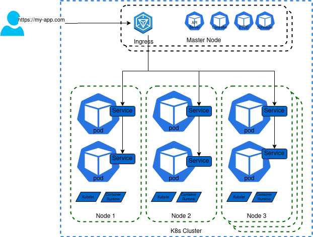

# High-Level Kubernetes Architecture

# 

## What Kubernetes is?

Open-source container orchestration tool originally developed by Google. It helps managing applications that made up hundreds of thousands of containers and help to manage in different environments (physical, VM, cloud or hybrid).  

## What problem does it solve?

The application development trend is moving from monolith to micro-services. Increased usage of containers using scripts and self-made tools in different environments is very complex. Demand for a proper way of managing those hundreds of containers raised the need to have container orchestration technologies. Kubernetes provides features like  

*   High Availability
*   Scalability
*   Disaster recovery

### Kubernetes cluster

*   Consist of multiple nodes. 
*   Set of worker machine nodes. Cluster shares the load. 
*   If one node goes down other nodes keep the application available.

### Nodes

*   A server or virtual machine that can host k8s pod.  
    
*   Each node can have multiple pods on it  
    

### Worker Node

*   A machine responsible to run containers. Have below Kubernetes components. Actually do the work
*   Pod  
    

*   Abstraction over containers
*   Host container runtime environment
*   Can have multiple container per pod but usually 1 container per pod
*   Runs container and some side service that is required to host the pod
*   Each pod gets its own IP address, pod communicate with each other using IP address.
*   If pod dies and re-created a new IP address is assigned. On such events it is very hard to communicate with pods. To come over of this situation service is used.

*   Service

*   Service have permanent IP address.
*   Every container pod will have its own service
*   Life-cycle of service and pod are not connected, so even if pod dies service and its IP address stay. This eases pod communication.
*   External Services open communication with pod to external world. Internal service allows pod to pod communication and helps to keep pods private with-in K8s cluster if not required to expose externally. Ingress
*   Internal DNS for K8s cluster. Request first goes to ingress and it does forwarding to service IP address  
    

*   Kubelet

*   Ensure the number of replica sets

*   Container runtime

*   To execute container images. The popular runtime is docker. Kubernetes also supports Rkt-io & CRI-O, containerd

*   Kube-Proxy  
    

#### Master Node  

*   Machine or set of machines responsible to run/execute below Kubernetes components. The master node is responsible for managing the cluster. If any node goes down the master node replaces it with another instance with the help of the controller.  
    
*   Manage worker node
*   Core Components  
    

*   ETCD

*   Key-value store. Externalize configuration.

*   Controller

*   The brain behind Kubernetes. Keep track of replica sets decides how to maintain the desired state.

*   Scheduler

*   Job Scheduler
*   Cron Scheduler

*   API Server

*   API Server is the gateway (frontend) to the Kubernetes cluster.
*   Exposes the REST interface to interact with Kubernetes components.
*   Validates and configure data for Kubernetes objects.
*   Command-line - kube-api \[flag\]

*   API Server components

*   API management - Expose REST API
*   API Path
*   API Transaction
*   API Discovery
*   Request processing - functionality that processes individual API request

*   Type of request \[get | list | post | delete\]

*   Life of request

*   AuthN
*   AuthZ / RBAC
*   Admission Control
*   Validate
*   Watch Operations
*   Encodings
*   Responses

*   Internal control loops - Perform necessary background operations for API Server.

*   Common Resource Definition(CRD) Control Loop

Core Components  

Core Components

## Kubernetes Physical Architecture  

  

  

Kubernetes Physical Architecture

  

## Logical Architecture

### Deployment

*   Replica Set

*   Pod

*   Container Runtime

*   Image
*   Fluentd - realtime distributed log collection service

### Service

*   Single access point for a group of pods
*   Provide consistent IP and port
*   Type of Service

*   NodePort
*   LocadBalancer

### Volume

*   K8s doesn't manage data persistance, must be managed externally like backup or replication  
    
*   A dictionary that can hold data
*   Component of the pod and not independent of it
*   Create in the pod specification
*   Can't be deleted its own
*   Accessible to all container on a pod
*   Pod dies --> volume dies
*   Advance than docker volume

### DeamonSet

*   Stateful

## Azure Kubernetes Service High-Level Architecture

Azure Kubernetes Service High-Level Architecture
